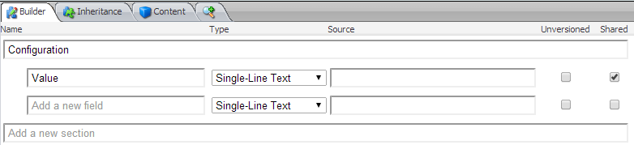

This is a repost from our german written [Sitecore
Vibes](http://sitecore.unic.com/de/2014/02/22/Sprachunabhaengige-Referenzen-mit-Glass-Mapper)
blog. It covers the topic to load referenced items without checking for a valid
language version for a specific field. This was initially one of my questions on
[Stack
Overflow](http://stackoverflow.com/questions/21531520/disable-version-check-for-specific-property-in-sitecore-glass-mapper)
where [Mike Edwards](https://twitter.com/mikeedwards83), developer of [Glass
Mapper](http://glass.lu/), answers my question and helped me also with
continuous problems, thanks again!

Our projects often have some configuration values which we configure with
Sitecore items. For all these configurations (which are shared, so the same in
every language), we have a `Specification` template with only one field for the
configuration value:



Our content item then gets a reference to one of these configuration items via a
Droplink (i.e. to configure the container type). Our Glass Mapper class for this
field would look like this

```csharp
[SitecoreField(FieldName = "Container Type")]
public virtual Specification ContainerType { get; set; }
```

Now by default, this only works if the `Specification` item has a language
version in the current `Context.Language`. While this is ok for our content
item, we don’t want to check this for the container type reference. We need to
add several parts to make this possible.

##Custom attribute
We need the attribute to say Glass Mapper that we want to do some special things
with the property. The attribute should only identify the property’s mapping
action and create an own configuration for the property (more on this later):

```csharp
public class SitecoreSharedFieldAttribute : SitecoreFieldAttribute
{
    public override AbstractPropertyConfiguration Configure(PropertyInfo propertyInfo)
    {
        var config = new SitecoreSharedFieldConfiguration();
        this.Configure(propertyInfo, config);
        return config;
    }
}
```

##Attribute configuration
As we saw before, the attribute returns a custom configuration. We also need to
implement this class. It’s important that Glass Mapper can identify the
attribute with it’s own configuration, hence we need to override the `Copy()`
method:

```csharp
public class SitecoreSharedFieldConfiguration : SitecoreFieldConfiguration
{
    public override SitecoreFieldConfiguration Copy()
    {
        return new SitecoreSharedFieldConfiguration
        {
            CodeFirst = this.CodeFirst,
            FieldId = this.FieldId,
            FieldName = this.FieldName,
            FieldSource = this.FieldSource,
            FieldTitle = this.FieldTitle,
            FieldType = this.FieldType,
            IsShared = this.IsShared,
            IsUnversioned = this.IsUnversioned,
            PropertyInfo = this.PropertyInfo,
            ReadOnly = this.ReadOnly,
            SectionName = this.SectionName,
            Setting = this.Setting
        };
    }
}
```

##Custom data handler to implement the functionality
We already told Glass Mapper to do some magic with our custom attribute. But
what is the magic? The magic happens in the data handler, which maps the data
from the Sitecore item to the code. While initializing, Glass Mapper assigns a
data handler to each property. The `CanHandle()` method checks if the
configuration of the property maps with the current data handler. The
`GetFieldValue()` simply returns the value from the default field type mapper,
with disabled language version check:

```csharp
public class SitecoreSharedFieldTypeMapper : SitecoreFieldTypeMapper
{
    public override object GetFieldValue(string fieldValue, SitecoreFieldConfiguration config, SitecoreDataMappingContext context)
    {
        using (new VersionCountDisabler())
        {
            return base.GetFieldValue(fieldValue, config, context);
        }
    }

    public override bool CanHandle(AbstractPropertyConfiguration configuration, Context context)
    {
        return configuration is SitecoreSharedFieldConfiguration && !configuration.PropertyInfo.PropertyType.IsGenericType;
    }
}
```

More informations about custom data handlers can be found in [this
tutorial](http://glass.lu/docs/tutorial/sitecore/tutorial19/tutorial19.html).

##Configure the data handler
The custom data handler must be registered while initializing Glass Mapper. With
the default installation (and the usage of [Castle
Windsor](http://www.castleproject.org/)), this can be done in the
`GlassMapperScCustom` class in the `App_Start` folder:

```csharp
public static void CastleConfig(IWindsorContainer container)
{
    var config = new Config();
    container.Register(Component.For<AbstractDataMapper>().ImplementedBy<SitecoreSharedFieldTypeMapper>().LifeStyle.Transient);
    container.Install(new SitecoreInstaller(config));
}
```

At the end we just need to change the attribute from our property to the
`SitecoreSharedFieldAttribute`:

```csharp
[SitecoreSharedField(FieldName = "Container Type")]
public virtual Specification ContainerType { get; set; }
```

The same behavior also works for list types (i.e. a Multilist). You only need to
configure our new attribute on your list:

```csharp
[SitecoreSharedField(FieldName = "Available Languages")]
public virtual IEnumerable<Specification> AvailableLanguages { get; set; }
```
