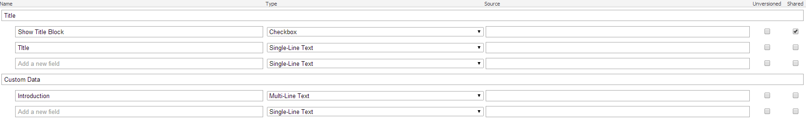

On a current project we extensively work with components, where each component
is represented by a view rendering (the complete solution is based on MVC). We
have the requirement that each component can have an additional title block
(which needs a lot of html markup). The title block can be enabled on a
component with a checkbox field.

When we have about 20 components, does it make sense that each developer needs
to handle this markup in his view rendering? No way! The developer shouldn’t
care about the title and the additional html markup in any way. The only thing
the developer of a component should care about is to be sure that the author can
set the checkbox for showing the title and the title of course (by adding the
fields to his data template or by inherit from a generic one).

Of course this could be done with partial views etc. But this way, the developer
has to add the partial view in his view rendering, so no solution for me. My
next idea was to automatically wrap the view rendering into another view. The
wrapping view should then create the markup for the title and render the
original view rendering as a partial view. So let’s start. Let us assume we have
the following data template:



And this will be rendered by the following view:

```csharp
@using Sitecore.Mvc
@Html.Sitecore().Field("Introduction")
```

Now where to add my wrapper view? After a bit of research I found that the
`mvc.getRenderer` pipeline is exactly what I was looking for. So let’s add a
processor to this pipeline. Directly after Sitecore has resolved the original
view rendering:

```xml
<configuration xmlns:patch="http://www.sitecore.net/xmlconfig/">
  <sitecore>
    <pipelines>
      <mvc.getRenderer>
        <processor patch:after="processor[@type='Sitecore.Mvc.Pipelines.Response.GetRenderer.GetViewRenderer, Sitecore.Mvc']"
                   type="Website.Pipelines.AddTitle, Website"/>
      </mvc.getRenderer>
    </pipelines>
  </sitecore>
</configuration>
```

This pipeline processor validates the renderer (the original one, resolved by
Sitecore and attached to the presentation of my item) and loads the datasource
item. If the title block should be shown, I rewrite the current renderer to my
wrapper view. The original renderer is remembered in the model. Here is the
code:

```csharp
namespace Website.Pipelines
{
    public class AddTitle : GetRendererProcessor
    {
        public override void Process(GetRendererArgs args)
        {
            // check context
            if (Sitecore.Context.GetSiteName() == "shell") return;

            // check current result
            if (!(args.Result is ViewRenderer)) return;
            if (args.Rendering == null || !Sitecore.Data.ID.IsID(args.Rendering.DataSource)) return;

            // get datasource item
            var dataSourceItem = args.PageContext.Database.GetItem(args.Rendering.DataSource);
            if (dataSourceItem == null) return;

            // check if component should add title block
            if (dataSourceItem["Show Title Block"] != "1") return;

            // add wrapper rendering
            var model = new WrapperModel
            {
                Renderer = args.Result as ViewRenderer,
                Title = dataSourceItem["Title"]
            };

            args.Result = new ViewRenderer
            {
                Model = model,
                Rendering = args.Rendering,
                ViewPath = "/Views/WrapperRendering.cshtml"
            };
        }
    }
}
```

There are two additional things, the wrapper model and the wrapper view. The
model is quite simple, just storing the original renderer and the title:

```csharp
public class WrapperModel
{
    public ViewRenderer Renderer { get; set; }

    public string Title { get; set; }
}
```

Also the view, very easy. Just generate the html markup for the title and
include the original view rendering as a partial view:

```csharp
@model Website.Models.WrapperModel

<h1>@Model.Title</h1>

@Html.Partial(Model.Renderer.ViewPath, Model.Renderer.Model)
```

In this example, the title is only shown within a heading tag. This is only a
small example, you can extend the wrapper view as well as the wrapper model as
you like or need.
