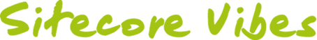

In September 2010 we started a Sitecore tech blog at
[Unic](http://www.unic.com/). The blog is called [Sitecore
Vibes](http://sitecore.unic.com/) and was initially started in German only.

Today we have migrated to the newest Sitecore and
[WeBlog](https://marketplace.sitecore.net/en/Modules/WeBlog.aspx) version and
also made the blog bilingual, where we want to write most of the posts in
English. We have also included the [Field Fallback
module](https://marketplace.sitecore.net/en/Modules/Field_Fallback.aspx) to have
a language fallback to the German blog posts. This means that you can simply
read the blog in English. All posts which are not translated to English are
marked with a flag and could be translated with Google Translate (or read in
German if you prefer).

This does not mean that this blog here will die. I will still be active here and
write blog posts, but I will also write more posts on Sitecore Vibes. So, stay
tuned and enjoy reading the new English blog in the universe. It’s definitely
worth adding it to your feed reader.
