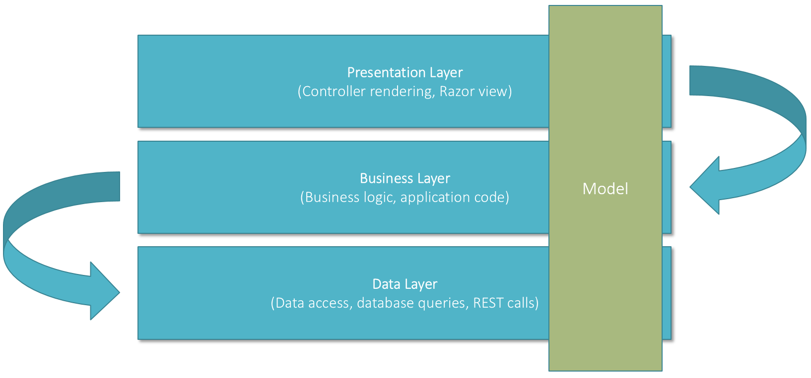

Today I had the chance to present at the first [Sitecore User Group
Switzerland](http://sugch.eventbrite.com/). The topic I’ve chosen is
"Three-layered architecture with Sitecore". Parts of the presentation were
explaining the architecture itself, mention different libraries to use with
Sitecore and to give a short demonstration. If you are only interested in the
presentation or the code, scroll down to the end of this post and download the
source. For all others I’m trying to give a short overview what I’ve talked
about.

##Introduction
The key points of a three-layered architecture are the following:

- **Separation of concerns**  
  Each code part or class is responsible for a single concern. We have separate
  classes responsible for the presentation, the business logic and the data
  access. This also makes it possible to split parts of the implementation to
  different developers (e.g. a database specialist creates the data access and a
  frontend specialist creates the presentation).
- **Abstraction and decoupling**  
  It helps us abstract the strong dependency on Sitecore and on other
  third-party web services. This allows us to mock data and create proper unit
  tests without any other tools.
- **DRY = Don’t repeat yourself**  
  Code can be easily reused and is easy to find. It’s easier to avoid code
  duplication and the code keeps clean and structured.

##The architecture
As the name says, the architecture is splitted into three layers with different
responsibilities. The model represents the data and is passed through the
different layers.

This architecture has the following rules (which are very strict):

- Each layer only has access to it’s underlying layers.
- Never allow the architecture to call layers the other way around.
- A layer never knows what the other layers do and what the data is used for.

Personally I think following this rules is the most important part when
implementing this architecture in one of your projects.

##The frameworks
Implementing this architecture is very easy, as they are many frameworks which
helps us. Basically we use Sitecore MVC, this starts with decouple the
presentation from the data and the application logic. Additionally we need a
framework for [dependency
injection](http://en.wikipedia.org/wiki/Dependency_injection) (I prefer
[Ninject](http://www.ninject.org/), but you could also use [another
one](http://www.hanselman.com/blog/ListOfNETDependencyInjectionContainersIOC.aspx)).
The dependency injection helps us decouple the classes and remove dependencies
between the different layers. Last but not least we need an [ORM
(object-relational
mapper](http://en.wikipedia.org/wiki/Object-relational_mapping)) to abstract
Sitecore databases (loading items etc.). I prefer [Glass
Mapper](http://glass.lu/), because it’s very powerful and easy to use.

##Download
The full presentation of this topic can be downloaded
[here](https://github.com/SUGCH/ThreeLayeredArchitectureWithSitecore/blob/master/doc/ThreeLayeredArchitectureWithSitecore.pdf).
The code I showed during the demonstration can be downloaded at
[GitHub](https://github.com/aquasonic/SUGCH2014) (including all documentation as
well).

If you have any feedback regarding the three-layered architecture or the
presentation at the Sitecore User Group, I would be very happy to hear from you.
You can either contact me via comment on this blog post or on Twitter
[@aquasonic](https://twitter.com/aquasonic).
