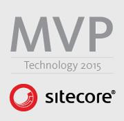

Every year, the most active Sitecore community members from around the world get
nominated as a Sitecore Most Valuable Professional (MVP). I’m very happy to
announce that I have been nominated as a [Sitecore MVP
2015](http://sitecore.net/mvp?sc_camp=8EB4850664E346B79A2BA153205139F6) in the
category **Technology**. I am one of 167 other MVP’s worldwide who have been
nominated in either the category _Technology_ or _Digital Strategies_. In
Switzerland there were 5 MVP nominations, four in the category _Technology_ and
one in _Digital Strategies_. Thank you Sitecore very much!

##Looking back
I remember in 2010 where I had my first Sitecore training, I wanted to become a
Sitecore MVP. I’m very proud to reach my goal this year. Here are some of my
activities I have done this year:

- Almost exactly one year ago I have started this blog. I have written 17 blog
  posts in 2014.
- I have also blogged for our company blog [Sitecore
  Vibes](http://sitecore.unic.com/) (7 blog posts).
- 3 contributions to the [Sitecore
  Marketplace](https://marketplace.sitecore.net/)
  ([Referenception](https://marketplace.sitecore.net/Modules/Referenception.aspx),
  [Error
  Manager](https://marketplace.sitecore.net/Modules/Sitecore_Error_Manager.aspx)
  and [Item
  Versioner](https://marketplace.sitecore.net/Modules/Sitecore_Item_Versioner.aspx)).

- Top 75 poster in the [SDN Forum](http://sdn.sitecore.net/Forum.aspx) and top
  21 on [Stack Overflow](http://stackoverflow.com/questions/tagged/sitecore).
- Co-founder and speaker at the first [Sitecore User Group
  Switzerland](http://sugch.eventbrite.com/) meeting.
- Some contributions to other blogs or GitHub repositories.

##What brings the future?
I have learned a lot during the last years working with Sitecore and I’m proud
when I can share my knowledge with other community members, and that is what I
want to do in the future as well. I will do my best to make the awesome Sitecore
community even better. The first step has already been done: In January, we have
participated at the [Sitecore
Hackathon](http://sitecorehackathon.org/sitecore-hackathon-2015/) with a team
from [Unic](http://www.unic.com/) ([Pascal Mathys](https://twitter.com/rootix),
[Tobias Studer](https://twitter.com/studert) and me). The result was the shared
source module Sitecore PackMan, available at
[GitHub](https://github.com/unic/SitecorePackMan) or the [Sitecore
Marketplace](https://marketplace.sitecore.net/Modules/Sitecore_PackMan.aspx). I
hope you like it :-)

##Also want to become a Sitecore MVP?
Are you also addicted to Sitecore and want to become a Sitecore MVP? Great,
let’s start today! A great start it the [MVP
website](http://sitecore.net/mvp?sc_camp=8EB4850664E346B79A2BA153205139F6) where
you find all information about the awards and how you can reach your goals.

Again, I’m very happy and proud to be part of this awesome community. Thank you
Sitecore! I also want to thank my company [Unic](http://www.unic.com/) who have
always supported me and made it possible to become a Sitecore MVP.
