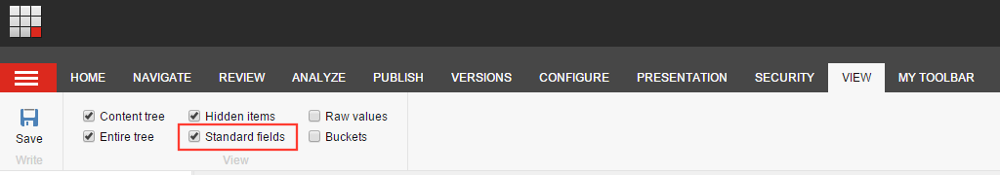

By default, the fields you add in your data templates are visible in the Content
Editor. Usually this makes sense. But sometimes you add some fields you need to
store some hidden information the author should not see or change. All default
fields from Sitecore are hidden (i.e. information about statistics etc.). You,
as an administrator, can show this fields by enabling the checkbox "Standard
fields" in the "View" Ribbon.



Adding fields which are only visible when this checkbox is enabled is very easy.
There is a (not well known) pipeline `getContentEditorFields` where you can
specify if a field is visible or not. The following processor overrides the
default one and shows or hides a field depending on the pipeline processor
configuration:

```csharp
public class GetFields : Sitecore.Shell.Applications.ContentEditor.Pipelines.GetContentEditorFields.GetFields
{
    private IList<string> fieldsToHide;

    public virtual string HiddenFields { get; set; }

    protected virtual IList<string> FieldsToHide
    {
        get
        {
            if (this.fieldsToHide == null)
            {
                if (string.IsNullOrWhiteSpace(this.HiddenFields))
                {
                    this.fieldsToHide = new List<string>();
                }
                else
                {
                    this.fieldsToHide = this.HiddenFields.Split(new[] { '|' }, StringSplitOptions.RemoveEmptyEntries);
                }
            }

            return this.fieldsToHide;
        }
    }

    protected override bool CanShowField(Field field, TemplateField templateField)
    {
        Assert.ArgumentNotNull(field, "field");
        Assert.ArgumentNotNull(templateField, "templateField");

        if (!UserOptions.ContentEditor.ShowSystemFields && (this.FieldsToHide.Contains(field.ID.ToString()) || this.FieldsToHide.Contains(field.Name)))
        {
            return false;
        }

        return base.CanShowField(field, templateField);
    }
}
```

You need to patch the default processor from Sitecore in your config file. There you can configure all fields which should be hidden by default (pipe separated):

```xml
<configuration xmlns:patch="http://www.sitecore.net/xmlconfig/">
  <sitecore>
    <pipelines>
      <getContentEditorFields>
        <processor type="Sitecore.Shell.Applications.ContentEditor.Pipelines.GetContentEditorFields.GetFields, Sitecore.Client">
          <patch:attribute name="type">YourNamespace.GetFields, YourAssembly</patch:attribute>
          <HiddenFields>{992A1370-3F5D-4E94-A437-2A3F7ECE4FB8}|{A60ACD61-A6DB-4182-8329-C957982CEC74}</HiddenFields>
        </processor>
      </getContentEditorFields>
    </pipelines>
  </sitecore>
</configuration>
```

If you want to completely hide a field (also with enabled standard fields
checkbox), you can simply remove the
`!UserOptions.ContentEditor.ShowSystemFields` from the if-statement in the
pipeline processor.

Hope this helps you cleanup all your fields for the content author.
