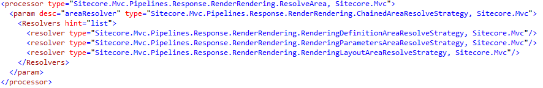
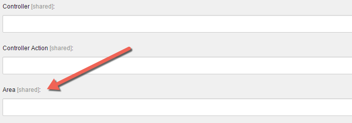

Since Sitecore 6.6 we have the possibility to implement our Sitecore solutions
with ASP.net MVC. There are a lot of features from pure MVC available in
Sitecore, but one important feature (especially when working in a multi-site
setup) is missing: The support for MVC areas. At my [SUGCON
presentation](http://slideshare.net/aquasonic/sugcon2015-sitecore-mvc-advanced)
earlier this year, I could mention that Sitecore is working on something. This
blog post now gives you an overview what Sitecore has added into version 8.1 to
support MVC areas out-of-the-box.

##How it works
For each MVC rendering, the pipeline `mvc.renderRendering` is called. In the
`Sitecore.Mvc.config` there is a new processor `ResolveArea` configured for this
pipeline. Within the processor configuration, you can configure a list of area
resolving strategies, which are responsible for resolving the area for the
current rendering: Each strategy is called after each other, until one strategy
can resolve the area.

The following image shows how the configuration looks like:



As you can see, the default resolver is `ChainedAreaResolveStrategy`. This
allows you to configure multiple resolvers which are called in a chain. If you
know that you will always only have exactly one resolver, you could also change
this.

##Available strategies
By default, there are three strategies available. The following paragraphs
describe all of them. Of course you can remove these strategies from the
configuration if you don’t need it.

###Resolve by rendering definition item
In the controller rendering definition item, there is a new field `Area`:



The area token is mostly used for the view resolution in your controllers and
views, not for resolving your controller from the definition item. Please
consider that Sitecore still needs a unique controller name in your rendering
definition items. You either need to have a unique controller name or add the
full name of the controller class into the `Controller` field.

###Resolve by rendering parameters
When adding a rendering to the presentation of your item (statically or
dynamically binded) you can add rendering parameters. This strategy allows to
add a parameter `area`. For a statically binded rendering in the code, this
could look like this:

```csharp
@Html.Sitecore().Rendering("<path or id>", new { area = "MyArea" })
```

###Resolve by layout definition
Similar to the rendering definition items, also the layout definition items got
a new `Area` field. This strategy takes the area from the layout attached to the
current item. Of course this means that each rendering of the current item takes
the same area (if no other strategy has resolved the area before).

##Adding your own strategy
We wouldn’t be in Sitecore if we could not extend it with our own strategy.
Adding a custom strategy is easy, you only need to create a new class
implementing `IAreaResolveStrategy`. The following example shows how you could
create a strategy to resolve the area by the current `Sitecore.Context.Site`:

```csharp
public class SiteAreaResolveStrategy : IAreaResolveStrategy
{
    public string Resolve(RenderRenderingArgs args)
    {
        var property = Sitecore.Context.Site.Properties["mvcArea"];
        return string.IsNullOrWhiteSpace(property) ? null : property;
    }
}
```

And configure the new strategy, including the property for each site:

```xml
<configuration xmlns:patch="http://www.sitecore.net/xmlconfig/">
  <sitecore>

    <pipelines>
      <mvc.renderRendering>
        <processor type="Sitecore.Mvc.Pipelines.Response.RenderRendering.ResolveArea, Sitecore.Mvc">
            <param desc="areaResolver" type="Sitecore.Mvc.Pipelines.Response.RenderRendering.ChainedAreaResolveStrategy, Sitecore.Mvc">
            <Resolvers hint="list">
              <resolver type="Website.SiteAreaResolveStrategy, Website"/>
            </Resolvers>
            </param>
        </processor>
      </mvc.renderRendering>
    </pipelines>

    <sites>
      <site patch:before="site[@name='website']"
            name="site1"
            inherits="website"
            virtualFolder="/site1"
            physicalFolder="/site1"
            startItem="/site1"
            mvcArea="Area1 "/>

      <site patch:before="site[@name='website']"
            name="site2"
            inherits="website"
            virtualFolder="/site2"
            physicalFolder="/site2"
            startItem="/site2"
            mvcArea="Area2"  />
    </sites>

  </sitecore>
</configuration>
```

That’s it. Happy area resolving :)
