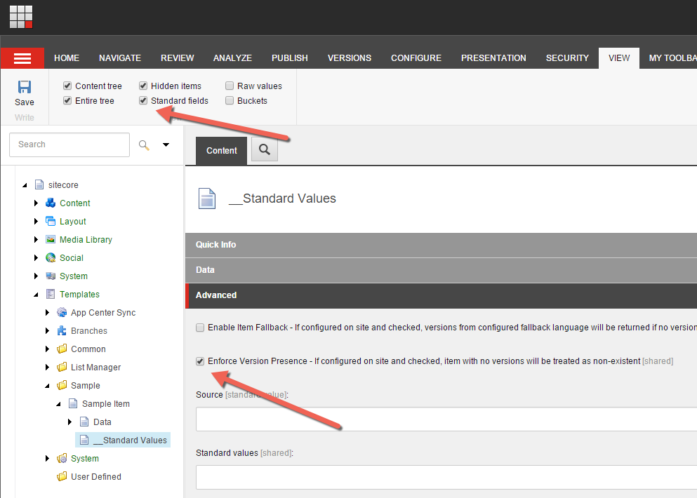

In a multi-language solution all the Sitecore items have different versions in
different languages. Depending on your configuration, you can load the items by
adding a language parameter in the url, e.g.:

```bash
English: http://mysite/en/myitem
German: http://mysite/de/myitem
```

Now what happens when `myitem` only has a language version in English, but not
in German? Right, this usually should result in a 404 (page not found) error
message. But it doesn't out-of-the-box. Check the following code:

```csharp
var language = Sitecore.Context.Language; // = de
var item = Sitecore.Context.Database.GetItem("<id>", language);
var itemIsNull = item == null; // = false
```

This means, Sitecore always returns an item, also when there is no language
version available. The item is called an `empty item`. Empty items contains
either empty values or Sitecore macros, like `$name`. My blog post about
[Provoke 404 for inexistent language
version](https://ctor.io/provoke-404-for-inexistent-language-version/) show you
how you can ensure that a language version exist.

In Sitecore 8.1, one of the new features is that you can configure if Sitecore
should return an empty item for inexistent language versions or if it should
return `null`. By default, this is disabled and everything works as it worked
before. To enable the feature, you need to set the property
`enforceVersionPresence="true"` in all your `<sites>`-configuration, including
the `shell` site. After doing this, you also need to enable it on all your items
where you want to have this enabled. I recommend doing this on the standard
values of your data templates. You can do this by activating the `Standard Fields` and then enable the checkbox for `Enforce Version Presence` in the
section `Advanced`:



Voila. If you want to disable this check for a particular code-snippet, you can
use the `EnforceVersionPresenceDisabler` to temporary disable it:

```csharp
using (new EnforceVersionPresenceDisabler())
{
    // Should now always return an item instance
    var item = Sitecore.Context.Database.GetItem("<id>");
}
```

A last hint: When you work with [Glass Mapper](http://www.glass.lu/) and load
items over it, Glass Mapper already checks if there is a valid language version
available and return `null` if not. But you should still enable this setting,
because Sitecore internally doesn't use Glass Mapper, so you would still need to
provoke the 404-page on your own.

For all my feature projects, this will definitely be default config. Hope this
helps you too to get rid of some code for validating language versions. The
official documentation on this feature can also be found on [Sitecore
docs](https://doc.sitecore.net/sitecore%20experience%20platform/creating%20and%20editing%20items/enforce%20version%20presence).
