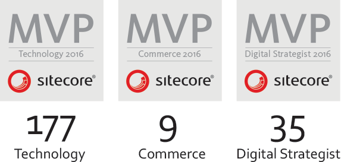

I am very happy to announce that [I was awarded as a Sitecore Technology Most
Valuable Professional
(MVP)](http://www.sitecore.net/About/Press-and-Media/Press-Releases/2016/02/MVP-Awards-2016)
for the second time in a row. This year, Sitecore has nominated 177 Technology,
35 Digital Strategist and 9 Commerce MVPs.

Thank you Sitecore for this award and the confidence in the community. It's a
honour. Also I want to congratulate all the [other
MVPs](http://www.sitecore.net/Events/Public-MVP-site/MVPs-2016.aspx) and thank
you for all your work, support and contributions.

If you want to know more about the MVP program or become one yourself, check out
the [MVP page](http://www.sitecore.net/mvp). Also check the following video,
which summarize the MVP program from last year.

<iframe width="100%" height="338" src="https://www.youtube.com/embed/u-tzDjJTsCE" frameborder="0" allowfullscreen></iframe>
