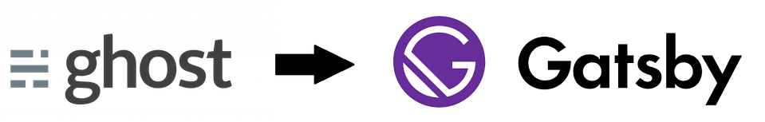

In 2014 I wanted to start a tech blog about my
[Sitecore](https://www.sitecore.com) journey. I was looking for a blogging
platform which is "by developers for developers". I didn't want a rich editor
where I had to format everything with a toolbar and a mouse click. I just wanted
to prepare my blog posts in notepad (or similar) and copy them to the backend of
the platform, in markdown.

After some research I found [Ghost](https://ghost.org/), an open source blogging
platform written in [Node.js](https://nodejs.org/). The first public version of
Ghost was released in October 2013, after a successful [Kickstarter
campaign](https://ghost.org/changelog/ghost-kickstarter). I love to support
startups and new ideas, so I wanted to try it out and subscribed to a Pro
account for about \$100 per year.

From the beginning I was enthusiastic about Ghost and blogged a lot. The user
interface is very clean and the posts could be written with ease. I am still a
big fan of Ghost and the features they have released so far.

But time is changing, and unfortunately also the frequency of my blog entries.
My last active blog post was is 2016, 4 years ago. After years of paying my pro
account without actually using it, I decided to migrate my blog to something
else which I can use for free. A few weeks ago my friend
[Pascal](https://twitter.com/rootix) started a new [blog](https://www.rootix.ch)
with [Gatsby.js](https://www.gatsbyjs.org) (and was [impressed by
it](https://rootix.ch/built-with-gatsby/)). So I thought this could be my new
platform as well.

The goal was to migrate my blog 1:1 from Ghost to Gatsby, with all the styles,
all content and all the URLs. I started with the [blog starter from
Gatsby](https://github.com/gatsbyjs/gatsby-starter-blog), which already contains
most of the needed features. With some help from Pascal's source code and the
sources on the Internet I was able integrate the missing parts like paging,
tagging, etc. with ease. Porting the
[theme](https://github.com/epistrephein/Steam) was also very straight forward,
as I could just copy & paste the CSS and split the components into React
components. In the end, I could also simply copy the entire content from Ghost
into my new markdown files.

8 days after the first commit, my blog has been fully migrated to Gatsby and is
running smoothly on [Netlify](https://www.netlify.com). The source is available
at [Github](https://github.com/aquasonic/Blog). After all, the developer
experience with Gatsby is really great and I hope to find more time to write
blog posts again. I have a lot of ideas and interesting stuff to share :-)
